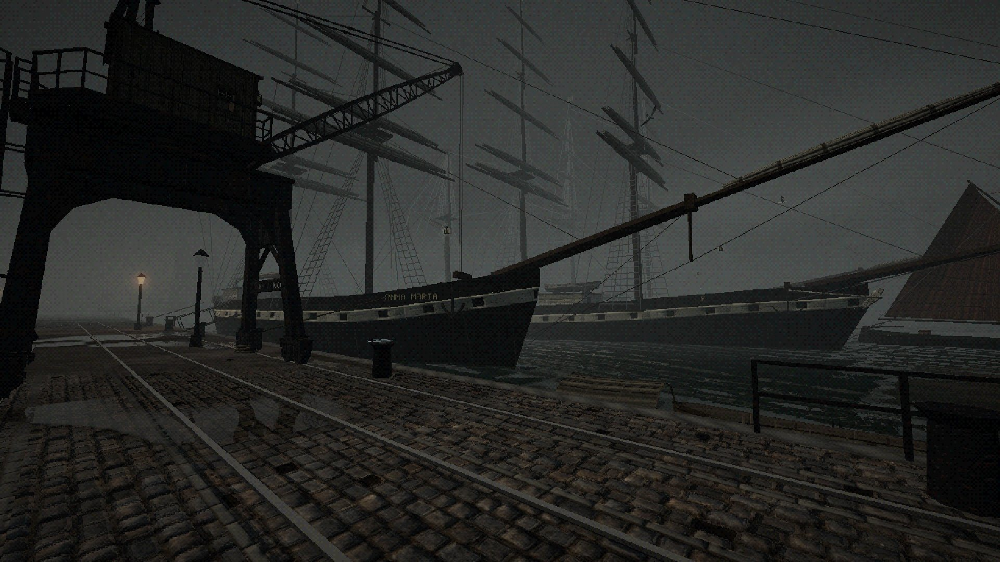
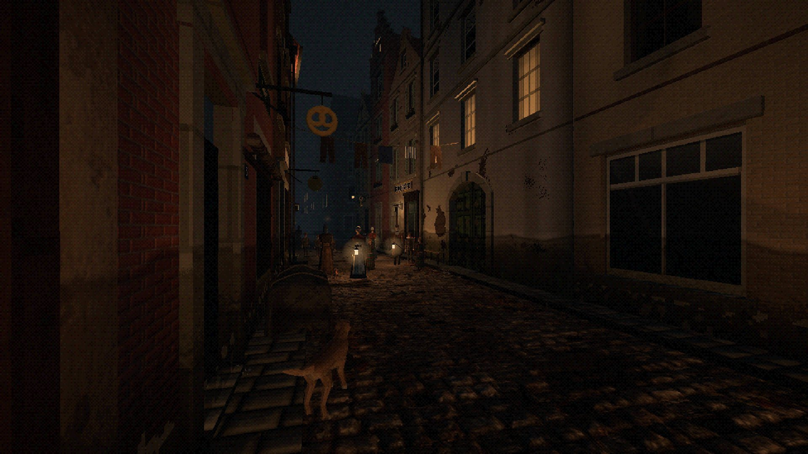
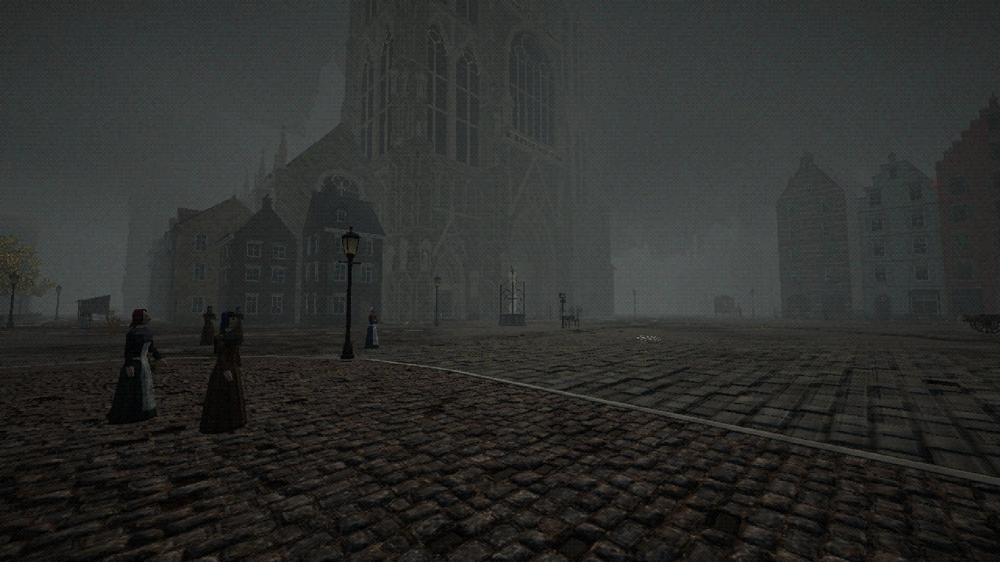
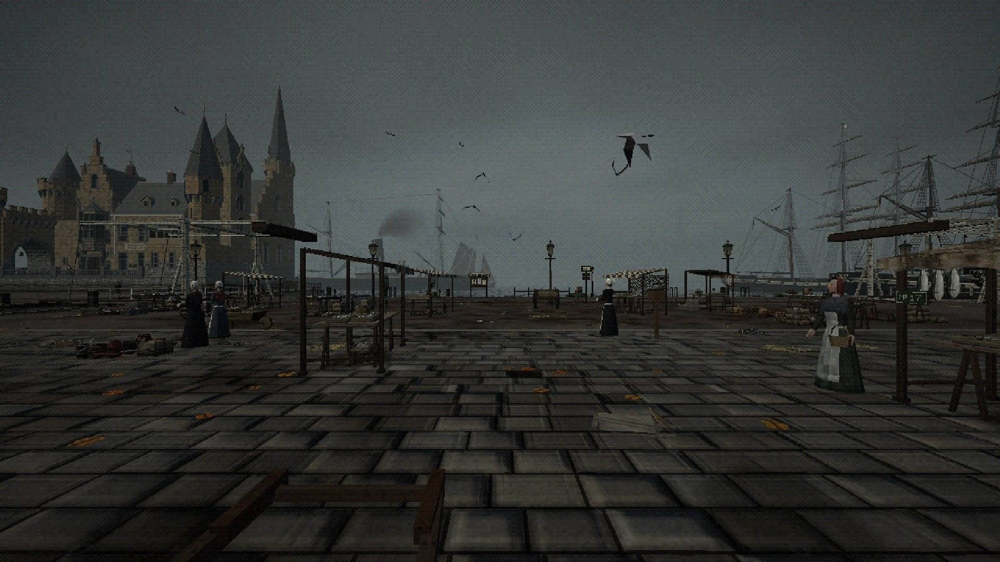
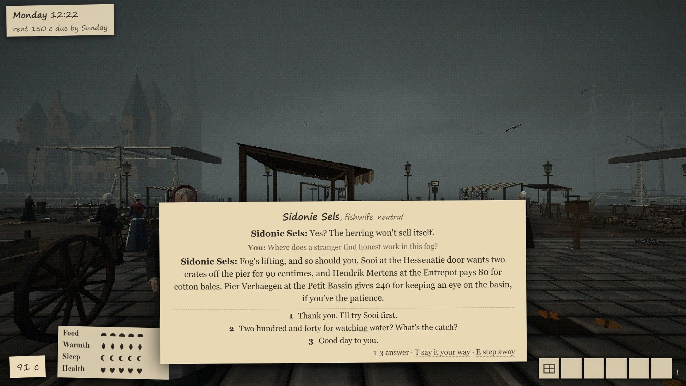
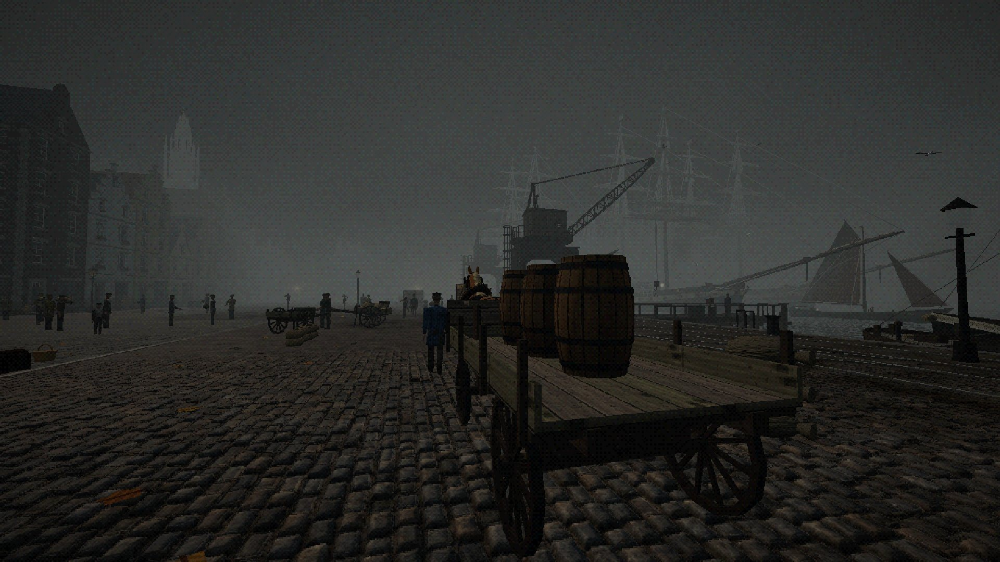
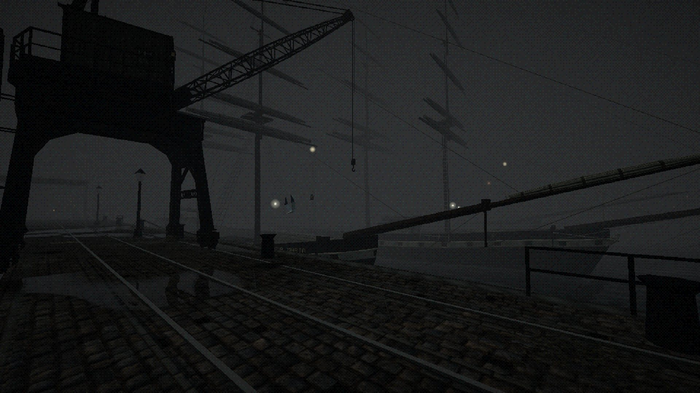

  

<h1 align="center">Scheldemist</h1>

  <i>Antwerp, autumn 1873. Fog on the Scheldt, work on the quays, and a town that remembers you.</i>

  <a href="https://github.com/Steve-Sitax/Moodygame/releases/latest"><b>Download for Windows, Mac and Linux</b></a>
  &nbsp;·&nbsp; <a href="#play-it">How to play</a>
  &nbsp;·&nbsp; <a href="docs/README.md">Design notes</a>

A 3D browser game in first person, with a PS1 look. You are Jef, new in town, with a few coins and
rent due by Sunday. You look for work on the quays. The townspeople talk, remember and act: an AI
proposes their words and plans, and the game engine checks every proposal and owns every number.

- **A real town.** The streets are traced from the 1873 Vuillaume map. About 190 townspeople have
  homes, trades, families and a day of their own.
- **Talk to anyone, in your own words.** Ask the fishwife for work, haggle at a stall, lie to the
  police. The town answers in its own voice, and the engine decides what it costs you.
- **Work the quays.** Carry, watch and deliver. A job can turn: a thief, a bribe, a load that breaks.
- **Things happen.** A director plans the town's events every game hour: fires, auctions, strangers,
  ballads on the corners, a sermon on Sunday.
- **Weather and night.** Mist, fog, rain and storms; gas lamps and lit windows after dark; tides,
  tall ships, cranes, opening bridges and a working lock.
- **Real rooms.** Every building you can enter is built inside, at its true size. You see the street
  from inside and the room from the street.
- **Play alone, or with the people in your house.** And with no AI at all, if you like: then it is a
  walk through 1873.

<table>
  <tr>
    <td width="50%"> A back alley after dark</td>
    <td width="50%"> The cathedral in the night fog</td>
  </tr>
  <tr>
    <td width="50%"> Het Steen and the fish market</td>
    <td width="50%"> "Where does a stranger find honest work in this fog?"</td>
  </tr>
  <tr>
    <td width="50%"> Morning on the Rijnkaai</td>
    <td width="50%"> Rain at dusk</td>
  </tr>
</table>

## Play it

**[Download the latest version](https://github.com/Steve-Sitax/Moodygame/releases/latest)**. You need to
install nothing.

1. On the download page, pick the file for your computer: Windows (`windows-x64.zip`), Mac with an Apple
   M1 or newer (`mac-arm64.zip`), or Linux (`linux-x64.tar.gz`).
2. Unzip it.
3. Start it:
   - **Windows:** double-click `Start Scheldemist.bat`. If Windows says "Windows protected your PC",
     click **More info**, then **Run anyway**.
   - **Mac:** double-click `Start Scheldemist.command`. If the Mac says it cannot open it, open
     **System Settings > Privacy & Security**, scroll down, click **Open Anyway**, and double-click the
     file again.
   - **Linux:** run `./start-scheldemist.sh`.
4. The game opens in your browser. Keep the small black window open while you play. Close it to stop.

Chrome gives the best speed. Your save is in the `data` folder; to move to a new version, copy `data`
into the new folder. `PLAY.txt` in the download says the same.

**The town's voice (AI).** The game works with no AI at all: the townspeople then use written lines. To let
an AI speak for the town, open the menu (Esc), then **AI setup**, and pick one:

| Choice | What you need |
|---|---|
| Claude, your Claude login | [Claude Code](https://claude.com/claude-code) installed; run `claude` once and log in |
| Claude, API key | a key from console.anthropic.com (paid per call) |
| Codex (GPT) | the Codex CLI installed and logged in |
| Ollama | [Ollama](https://ollama.com) on your computer with a model pulled (free) |
| Any OpenAI-compatible server | its address, model name and key |
| No AI | nothing: walk around |

Press **Test** next to your choice to see if it works. More in `docs/ai-setup.md`.

## Run it from the source (developers)

1. Install Node.js 24 or newer.
2. `npm run setup` once, then `npm run dev` in this folder.
3. Open http://localhost:5173. The server runs on 127.0.0.1:8787; the save is `data/game.sqlite`.

`node tools/package.mjs` makes the player's download for your own system; `docs/release.md` says how a
Release is made. The design notes start at `docs/README.md`.

## Licence

Copyright (C) 2026 Steve (Sitax)

Scheldemist is free software under the GNU Affero General Public License, version 3 or (at your
option) any later version. The full text is in `LICENSE`.

In short: you may use, study, change and share the game, as long as what you pass on stays under
the same licence with its source. If you run a changed version on a server that other people play
over a network, you must offer them the source of your version too.

This program comes with no warranty; see sections 15 and 16 of the licence.

Third-party material keeps its own licence. Every sound, font, picture and data source, and where
it came from, is listed in `assets/ATTRIBUTION.md`. Among them: CC0 sounds (Kenney, BigSoundBank,
Freesound), fonts under the SIL Open Font License 1.1 (installed from npm), a street plan traced
from the 1873 Vuillaume map (CC0), and landmark outlines from OpenStreetMap
(© OpenStreetMap contributors, available under the Open Database License 1.0). The npm packages
keep their own licences; the Claude Agent SDK is Anthropic's proprietary software, installed by npm
and not part of this repository.
