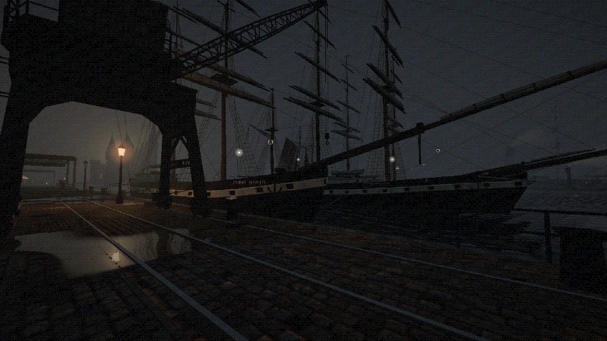
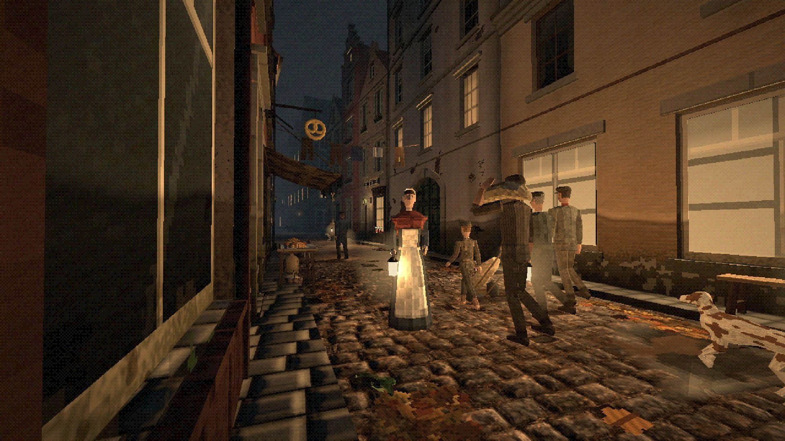
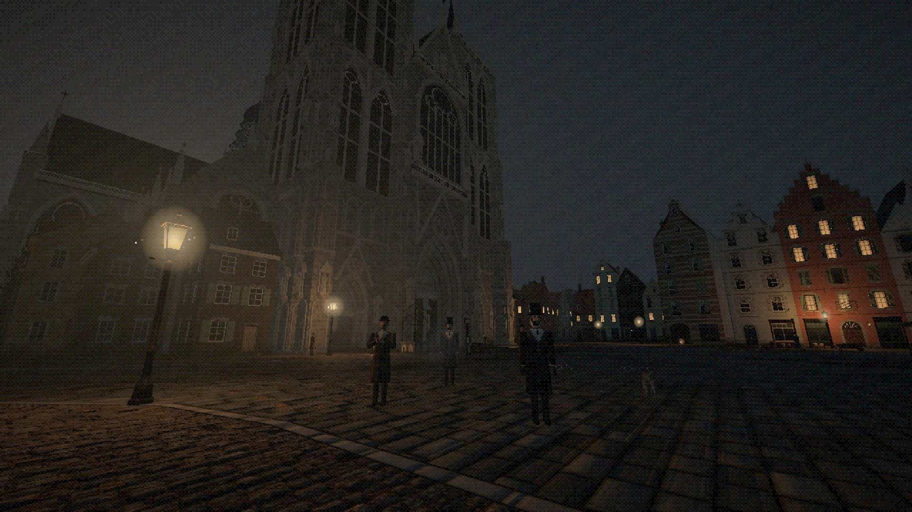
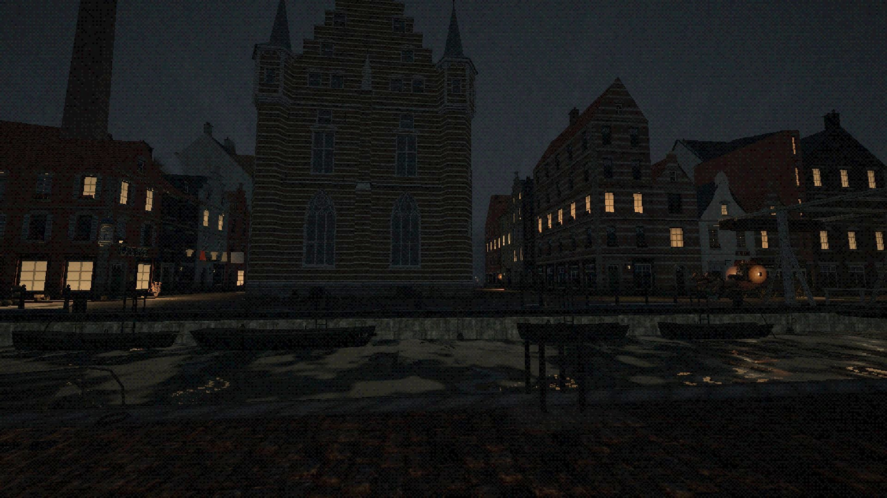
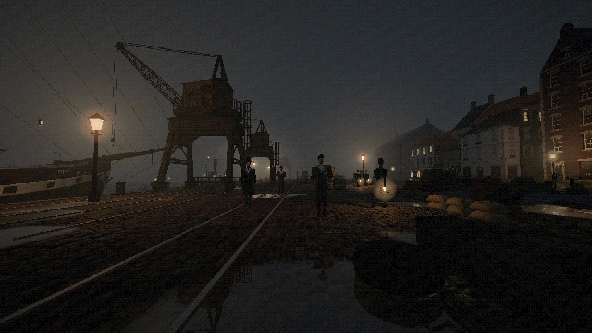
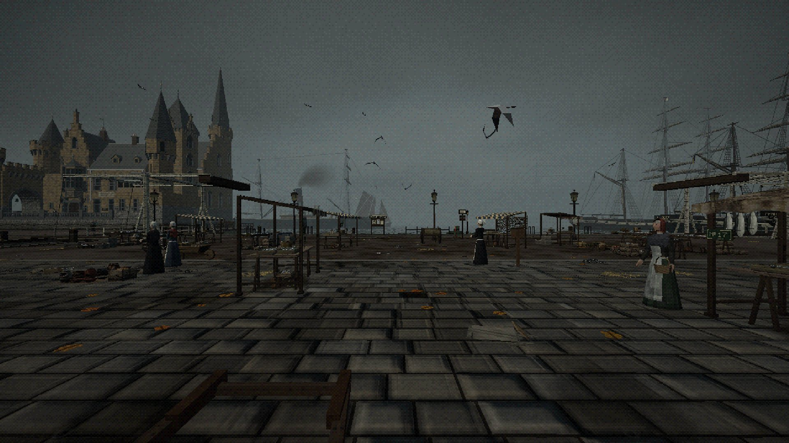
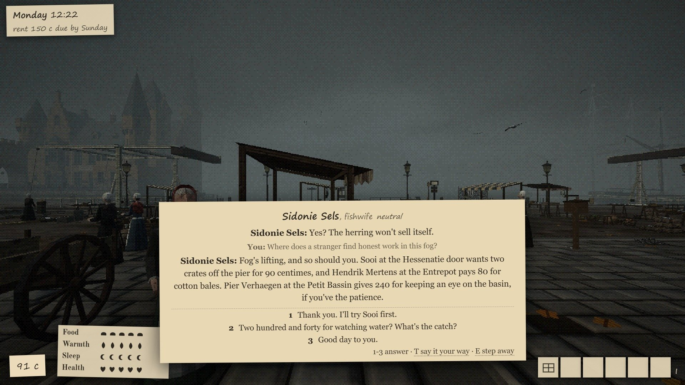

<p align="center">
  
</p>

<h1 align="center">Scheldemist</h1>

<p align="center">
  <i>Antwerp, autumn 1873. Fog on the Scheldt, work on the quays, and a town that remembers you.</i>
</p>

<p align="center">
  <a href="#play-it"><b>Play in Godot</b></a>
  &nbsp;·&nbsp; <a href="native-godot/README.md"><b>Edit the town yourself</b></a>
  &nbsp;·&nbsp; <a href="docs/README.md">Design notes</a>
  &nbsp;·&nbsp; <a href="#made-with-ai">Made with AI</a>
</p>

A native Godot game in first person. You are Jef, new in town, with a few coins and
rent due by Sunday. You look for work on the quays. The townspeople talk, remember and act: an AI
proposes their words and plans, and the game engine checks every proposal and owns every number.

- **A real town.** The streets are traced from the 1873 Vuillaume map. Several hundred townspeople have
  homes, trades, families and a day of their own.
- **Talk to anyone, in your own words.** Ask the fishwife for work, haggle at a stall, lie to the
  police. The town answers in its own voice, and the engine decides what it costs you.
- **Work the quays.** Carry, watch and deliver. A job can turn: a thief, a bribe, a load that breaks.
- **Things happen.** A director plans the town's events every game hour: fires, auctions, strangers,
  ballads on the corners, a sermon on Sunday.
- **Weather and night.** Mist, fog, rain and storms; gas lamps and lit windows after dark; tides,
  tall ships, cranes, opening bridges and a working lock.
- **Real rooms.** Every building you can enter is built inside, at its true size. You see the street
  from inside and the room from the street.
- **Play alone, or with the people in your house.** Godot runs the town's rules and multiplayer server.
  With AI disabled, the game uses written dialogue and engine-controlled events.

<table>
  <tr>
    <td width="50%"><br><sub>A back alley at eight in the evening</sub></td>
    <td width="50%"><br><sub>The cathedral from the Handschoenmarkt</sub></td>
  </tr>
  <tr>
    <td width="50%"><br><sub>The Vleeshuis over the canal</sub></td>
    <td width="50%"><br><sub>After the rain on the Rijnkaai</sub></td>
  </tr>
  <tr>
    <td width="50%"><br><sub>Het Steen beyond the fish market</sub></td>
    <td width="50%"><br><sub>"Where does a stranger find honest work in this fog?"</sub></td>
  </tr>
</table>

## Play it

In this checkout, open `native-godot/Start Native Town Game.cmd` and choose **Walk into town**.
The full town, menus, residents, interiors, weather and game rules run in Godot. The Windows standalone
package opens with `Play Scheldemist.cmd`; keep its executable, PCK and runtime folder together. It needs
no Node, browser, source checkout or runtime bake. Export and multiplayer test evidence is recorded in
[native project notes](native-godot/README.md) and [packaging notes](native-godot/world/notes/standalone-export.md).

WASD moves, Shift runs, Space jumps, E interacts, I opens pockets, J opens the quest book, M opens the map,
P pauses and Esc opens the menu. For object placement, open `native-godot/Start Workshop.cmd`; place, move,
copy or delete a lamp and save its district layout. The full game reads those saved layouts.

Native game data uses `%APPDATA%/ScheldemistWorkshop/native-playtest`; dedicated servers use a separate
`native-server` folder. Editor layouts remain under `ScheldemistWorkshop/layouts`. Steve explicitly waived
old game-save compatibility, and the identified legacy game saves were removed. Layouts, preferences and
provider credentials were retained.

Steve authorized integrating the completed Godot conversion into `main` on 2026-10-12. Automated checks
are recorded separately from his manual testing. The final standalone folders are
`D:/Code/ScheldemistPackages/final-client-20261012-portable` and
`D:/Code/ScheldemistPackages/final-server-20261012-portable`; open their Play or Start Server shortcut.
The old browser/server/bake entrypoints have been removed from the active project, with original art and useful
historical references checksum-archived under `art-source` and `docs/archive`.

Multiplayer uses the same native rules in an in-game host or a headless Godot process. Development server:
`native-godot/Start Native Server.cmd -Port 8800`. Exported server: `Start Server.cmd --port 8800`.
Join through the game's Together menu using the host's address and join code.

**The town's voice (AI).** The game works with no AI at all: the townspeople then use written lines. To let
an AI speak for the town, open the menu (Esc), then **AI setup**, and pick one:

| Choice | What you need |
|---|---|
| Claude, your Claude login | [Claude Code](https://claude.com/claude-code) installed; run `claude` once and log in |
| Claude, API key | a key from console.anthropic.com (paid per call) |
| Codex (GPT) | the Codex CLI installed and logged in |
| Ollama | [Ollama](https://ollama.com) on your computer with a model pulled (free) |
| Any OpenAI-compatible server | its address, model name and key |
| No AI | nothing: use written dialogue and native game rules |

Press **Test** next to your choice to see if it works. More in `docs/ai-setup.md`.

## Run it from the source (developers)

Use Godot 4.7.2 Mono and a .NET SDK supporting .NET 8. Build `native-godot/Scheldemist.Native.csproj` or
use its launchers. Open `native-godot/project.godot`: F5 runs the full game; F6 runs the currently edited
district. The sibling `godot/src` project supplies the native C# core and is built automatically.

```powershell
dotnet build native-godot/Scheldemist.Native.csproj
pwsh -File native-godot/scripts/open-native-town.ps1
pwsh -File native-godot/scripts/export-native-windows.ps1 -Output D:/Code/ScheldemistPackages/client
```

Game services, networking, navigation and saves are native C#/SQLite. Godot resources supply the town and
models. Static rules, audio and auxiliary images are bundled and extracted into a versioned local cache.
No web build or bake step belongs in the game startup. See [service checks](native-godot/services/README.md),
[authoring](native-godot/README.md) and [standalone export](native-godot/world/notes/standalone-export.md).

## Made with AI

Scheldemist is an experiment: the whole game was made by AI, steered by one person. Steve (Sitax)
designed it, played it and decided; Claude (Anthropic's Claude Code, mostly Claude Opus 5.5) wrote the
code, the Blender scripts that build every model, the tests and the docs. Most textures and concept
pictures were made with OpenAI's image tool through Codex. The sounds are CC0 recordings and the fonts
are free fonts made by people (see `assets/ATTRIBUTION.md`); the street plan is traced from the 1873
Vuillaume map.

What it took, up to version 0.1.0 (counted from the Claude Code logs on the main PC):

| | |
|---|---|
| Time | 5 days, 23 to 27 September 2026; about 70 hours with an AI at work |
| Sessions | 37 Claude Code sessions, plus 238 helper agents they started |
| Tokens | about 16 billion processed; most were re-read from the cache, about 190 million were new, and about 11 million were written out |
| Commits | about 300 |

Not counted: the work on the laptop, the Codex runs for the pictures, and the AI calls the game makes
while you play.

The October 2026 Godot conversion moved the complete town, object editing, gameplay services and multiplayer
into native resources and C#. The figures above describe the original 0.1.0 development, before this conversion.

## Licence

Copyright (C) 2026 Steve (Sitax)

Scheldemist is free software under the GNU Affero General Public License, version 3 or (at your
option) any later version. The full text is in `LICENSE`.

In short: you may use, study, change and share the game, as long as what you pass on stays under
the same licence with its source. If you run a changed version on a server that other people play
over a network, you must offer them the source of your version too.

This program comes with no warranty; see sections 15 and 16 of the licence.

Third-party material keeps its own licence. Every sound, font, picture and data source, and where
it came from, is listed in `assets/ATTRIBUTION.md`. Among them: CC0 sounds (Kenney, BigSoundBank,
Freesound), fonts under the SIL Open Font License 1.1 (installed from npm), a street plan traced
from the 1873 Vuillaume map (CC0), and landmark outlines from OpenStreetMap
(© OpenStreetMap contributors, available under the Open Database License 1.0). The npm packages
keep their own licences; the Claude Agent SDK is Anthropic's proprietary software, installed by npm
and not part of this repository.
