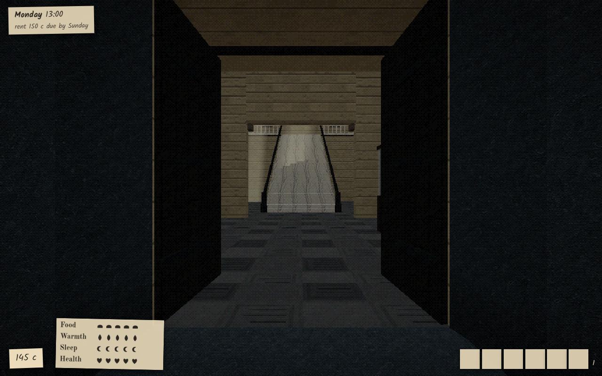
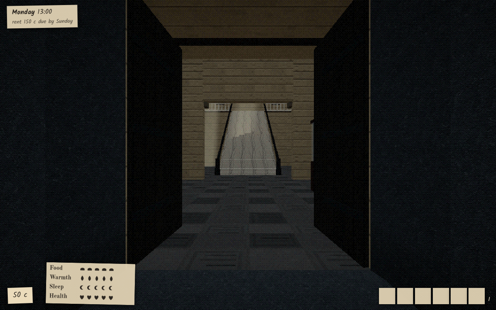
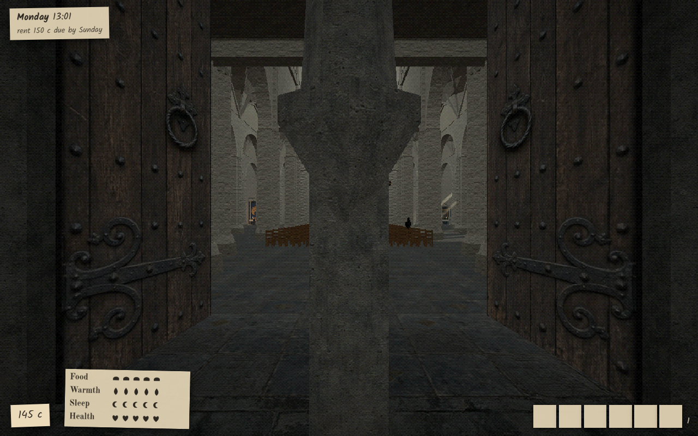
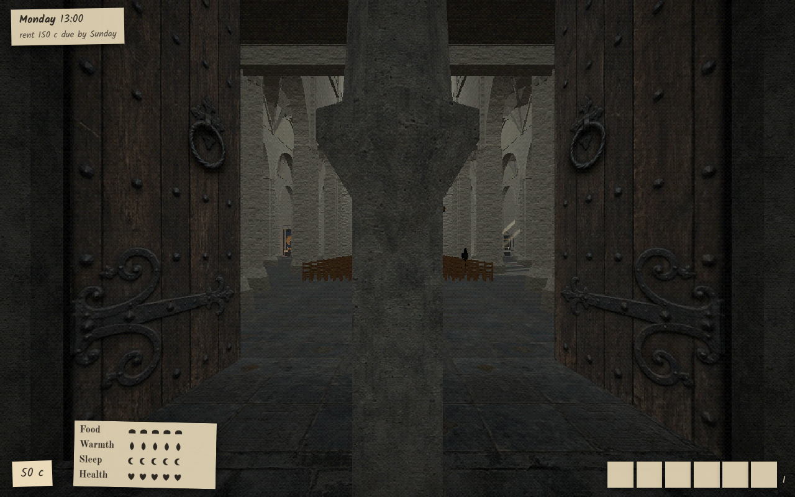
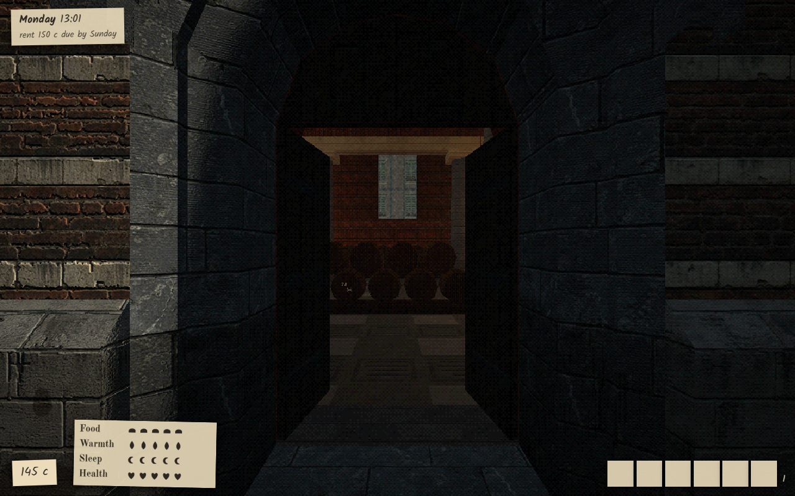
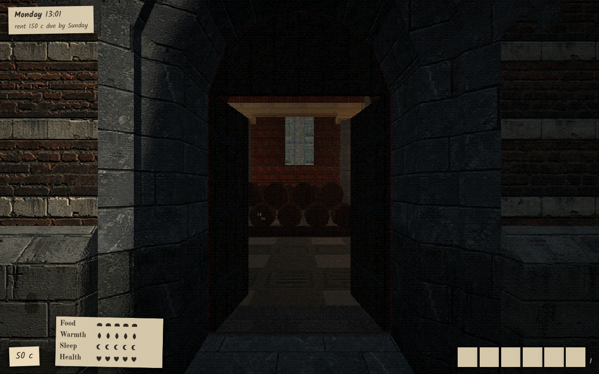
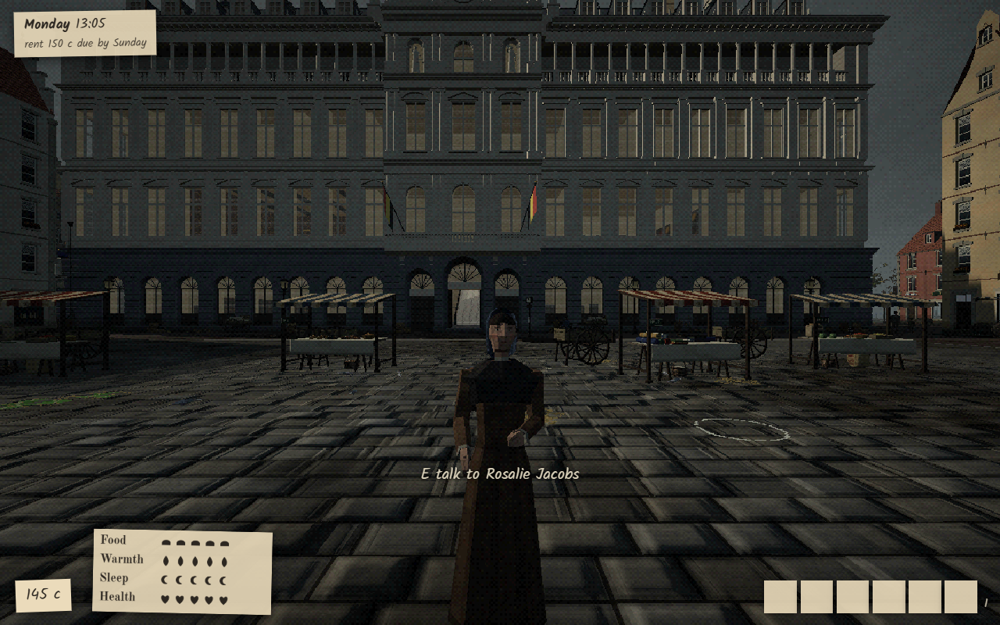
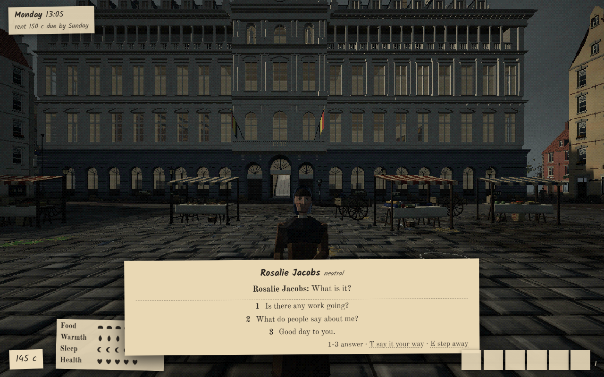
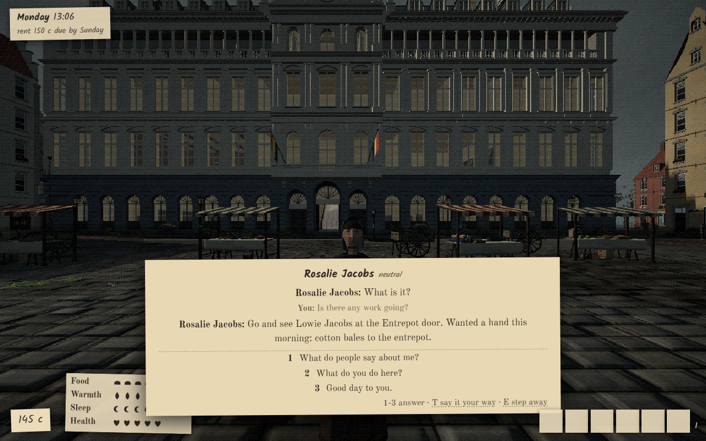

# Godot branch: browser regression check

Checked on 2026-10-04, branch `godot/browsercheck`, starting at `908a1e13418c3e73d2cc71dc5768c73a7b6467f5`.
Comparison base: `git merge-base main HEAD` = `35abc3f3d4c6fa4042b0e03ed25bc1d736baf352`.
Only this worktree was used. No player save, `.claude/`, keys, or another worktree was read or copied.

## Change inventory

`git diff --stat 35abc3f HEAD -- server client shared tools` at the starting commit reported **36 files, 2,320 insertions, 14 deletions**. The complete output is in [diff-stat.txt](godot-browsercheck/diff-stat.txt). There are **no changes under shared/**. The following lists every changed file, including `tools/godot/` but excluding the top-level `godot/` tree.

| File | What changed | Browser effect |
|---|---|---|
| `client/src/game/town.ts` | Uses optional server activity anchors before the old seeded spread. | Real bug fix: moves invalid outdoor destinations to reachable ground. Valid destinations retain the old spread. |
| `client/src/main.ts` | Exposes PSX uniforms and the texture registry in the dev kit. | Dev-only export access; no drawing or game-rule change. |
| `client/src/net/api.ts` | Types the optional town anchors field. | Protocol/type addition supporting the position repair. |
| `client/src/retro/psx.ts` | Records material options and texture UUIDs for baking. | Adds metadata and a retained texture registry during material creation. Shader bodies, uniforms and program cache keys are unchanged; no intended pixel change. |
| `client/src/world/rijnkaai.ts` | Optional callback receives the computed reachability grid. | Existing path callers use the same algorithm; bake tooling can inspect it. |
| `client/src/world/spill.ts` | Adds `spillBake()` to serialize stationary light sources. | Read-only export function, not called by the normal render loop. |
| `server/src/config.ts` | Optional `SCHELDEMIST_DATA` redirects database default and AI working directories. | Defaults remain the checkout's data directory. Explicit override supports player downloads and isolated tests. |
| `server/src/index.ts` | Adds anchors to `/api/town`. | Additional JSON field consumed by the repaired browser positions. No new HTTP route in this diff. |
| `server/src/town/population.ts` | Types optional anchors on Town. | Type addition; population generation and stats are unchanged. |
| `server/src/town/store.ts` | Computes repaired stroll/play/loiter/market anchors when loading the town. | Real bug fix: tests body clearance and reachability; supplies deterministic replacements without a save migration. Changes invalid endpoints and the routes to them. |
| `server/src/town/walkmap.ts` | `nearestOpen` requires body clearance as well as a reachable grid cell; rechecks rounded results. | Real bug fix: prevents snapping people into walls at lane edges. Affects callers that need an open point. |
| `server/src/town/whereabouts.ts` | Uses a supplied repaired anchor before the original activity calculation. | Server and browser use the same corrected destinations. Other schedule/pace calculations are unchanged. |
| `server/test/ways.test.ts` | Checks activity anchors, includes anchors and the resident roster in cloned pure-function inputs. | Tests only. Preserving the roster fixes a test fixture that previously omitted haul-spacing inputs. |
| `tools/godot/build-server.mjs` | Compiles and packages the Node server, shared files, runtime assets, dependencies and Node runtime. | Opt-in packaging only; does not run with the browser game. |
| `tools/godot/check-soundtest.mjs` | Compares sound test conversion and timing reports. | Opt-in report validation only. |
| `tools/godot/checks.mjs` | Runs bounded Godot checks against disposable seed-1873 towns, collects reports and cleans up. | Opt-in test runner only. |
| `tools/godot/deeds-check.mjs` | Runs isolated Godot deed/performance/dialogue checks and removes their test database. | Opt-in test runner only. |
| `tools/godot/deeds-fixture.ts` | Prepares deterministic deed and police situations in the self-test database. | Opt-in fixture only; not loaded by the server entry point. |
| `tools/godot/events-check.mjs` | Runs a bounded isolated Godot events test. | Opt-in test runner only. |
| `tools/godot/export-scene.mjs` | Exports the running browser scene, materials, textures, lights, walk grids, views and reference measurements. | Explicit bake only; its browser hooks are additive. |
| `tools/godot/map-ref.mjs` | Captures browser map reference pictures. | Opt-in screenshot utility only. |
| `tools/godot/menu-refs.mjs` | Captures browser menu reference pictures. | Opt-in screenshot utility only. |
| `tools/godot/models.mjs` | Decodes public Draco GLBs into separate Godot model outputs. | Reads browser assets; does not replace them. |
| `tools/godot/package.mjs` | Assembles native Godot player downloads and their bundled server. | Opt-in packaging only. |
| `tools/godot/peopledata.mjs` | Generates Godot room/home/role tables from browser/shared plans. | Reads public source plans; writes Godot output only. |
| `tools/godot/places-check.mjs` | Runs bounded Godot place interaction checks. | Opt-in test runner only. |
| `tools/godot/places-data.mjs` | Generates Godot place/interior/furniture/seat data from shared plans and browser source. | Reads public source data; writes Godot output only. |
| `tools/godot/play-check.mjs` | Runs a bounded Godot player-action check. | Opt-in test runner only. |
| `tools/godot/play-fixture.mjs` | Inserts a deterministic telegram job into a guarded test database. | Opt-in fixture only; normal player routes still execute its actions. |
| `tools/godot/profile-parts.mjs` | Adds/removes diagnostic process/physics probes in Godot source. | Explicit Godot-only source instrumentation. |
| `tools/godot/ride-check.mjs` | Runs a bounded isolated Godot ride check. | Opt-in test runner only. |
| `tools/godot/server.tsconfig.json` | Emitting TypeScript configuration for the packaged server/shared source. | Normal browser and server build configurations are unchanged. |
| `tools/godot/shareddata.mjs` | Generates C# copies of shared numeric tables. | Reads shared source; does not change browser values. |
| `tools/godot/talk-refs.mjs` | Captures browser dialogue, work, shop and other UI references in no-AI mode. | Opt-in reference utility only. |
| `tools/godot/test-download.mjs` | Unpacks and runs a real Windows Godot download in temporary locations, then cleans up. | Opt-in download check only. |
| `tools/godot/wherecheck.mjs` | Computes server-side whereabouts reference answers for Godot comparison. | Reads public town/way APIs and source calculations; no normal browser behavior change. |

The helpers were audited, not all executed: several default to a shared Godot bake or a save-copy stack. They were not used with those defaults. No price, wage, need, clock-rate, population-generation, job-outcome or dialogue-rule change is present in this diff. The position/route repairs above are the intentional shared behavioral differences, named as real bug fixes in `CHANGELOG.md`.

## Automated checks

- `npm run setup`: installed independent dependencies in this worktree, with no junctions or symlinks. The incidental npm lockfile metadata edit was restored.
- `npm test`: **102 files / 1,395 tests passed**, exit 0 (192.03 seconds).
- `npm run build`: client TypeScript and Vite production build plus server typecheck passed, exit 0. Vite reported the existing public-JSON import-attribute and large-chunk warnings; they did not fail the build.
- `node --check` passed for the browser harness, test-stack helper and commit checker.

## Browser evidence

Headless Chrome, 1280 × 800, muted, on isolated server/Vite ports **8875/5375**. The usual save-copy helper conflicts with the instruction never to read saves, so this audit adds `tools/teststack.mjs --fresh`: it creates a disposable seed-1873 town in `.test-stacks/`, selects walk-around mode (no AI), and disables the map server. Start and stop both receive `--fresh`. Arrival is marked ashore through the normal dev-stack API before loading the final check, preventing the fresh-game ferry from moving the camera.

The runnable evidence collector is `tools/browsercheck.mjs`; it requires an already-running isolated stack. For the final functional check:

```powershell
node tools/teststack.mjs start browsercheck --fresh --server 8875 --vite 5375
# The harness posts the test arrival routes before opening the game.
node tools/browsercheck.mjs
node tools/teststack.mjs stop browsercheck --fresh --server 8875 --vite 5375
```

Raw final evidence: [results.json](godot-browsercheck/results.json). Extra five-place measurements: [details.json](godot-browsercheck/details.json), [perf.json](godot-browsercheck/perf.json).

| Requested check | Evidence |
|---|---|
| Town loads | Loader reaches `menu`, city/assets/shaders/doors complete; canvas is 1280 × 800. |
| Paths | `__scheldemist.paths()` returns `[]`. |
| Shaders | `__scheldemist.shaders().problems` returns `[]`, no warm-up work pending. |
| Stuck walkers | 12-second checks at the Vismarkt, Grote Markt, Cathedral, Handschoenmarkt and Rijnkaai return `stuck: []`. Numeric coordinates avoid the existing name-resolution problem. |
| Take and finish work | `t.job({type:'watch'})` takes the real generated 90-second watch at `west_sheds`; bounded `t.run(30)` calls finish it; the normal server outcome marks it `done` and pays 80 centimes. |
| Talk with choices, no AI | An ordinary generated resident supplies three engine choices. Pressing 1 adds Jef's question and a work referral, with another choice list. No typed line or model call is used. |
| Midday close views | Needs full, clear weather, hour 13; inspected the town-hall door, cathedral portal, Vleeshuis door and dialogue pictures. Stone, brick, wood, metal fittings and visible interiors are drawn. |

Sooi's offline opening says “Not now, lad” and ends the conversation. That is the existing fixed-employer fallback on main, not a port regression; ordinary residents provide the requested engine-driven choices. The final harness summons an ordinary resident with the kit, so the physical subject is also present.

A long repeat initially tried taking work after an engine tempest had begun: the take route correctly returned HTTP 409, “Nobody sends anything out in this storm.” Setting clear weather with `t.light()` does not finish a running event. Those unchanged main rules were preserved; the final fresh run takes and finishes work before the longer visual checks. It does not bypass take validation or edit the test database to force payment.

### Real bug-fix proof

[anchors.json](godot-browsercheck/anchors.json) compares the original spread (same anchor function with no replacement table) with the repaired anchors in an in-memory seed-1873 town: **895 residents, 430 unique replacement anchors, 830 invalid weekday/Sunday segments before repair, 0 remaining invalid segments**. Repeated schedule segments account for the difference between segment and unique-anchor counts. All repaired endpoints pass both reachability and 0.3 m body clearance. This identifies the browser movement change as an existing placement bug repair, rather than a change to game numbers.

### Main comparison and performance limits

The exact merge-base versions of every changed runtime source under client/server/shared were temporarily supplied in this worktree, tested on **8876/5376**, and restored byte for byte in a `finally` block. No other checkout was accessed. The reference town was also fresh, seed 1873, offline and ashore. Main reference evidence is in [main/details.json](godot-browsercheck/main/details.json).

Inspected the same three close camera positions on both versions. Their architecture, materials, light and visible interiors match visually. This is visual inspection, not a frozen pixel-equivalence assertion; NPCs, animation and small clock differences are allowed to vary. The PSX diff changes export metadata outside the shader compiler body, not shader code. The main reference runner completed loading, paths, shaders, all five stuck checks and all architecture pictures, then stopped because its optional resident selector found no visible resident beside the Vleeshuis. That was a harness selection limitation, corrected by summoning a resident for the final branch run; it is not a main dialogue failure.

The extra performance gate **does not pass**. `node tools/perfcheck.mjs --report docs/godot-browsercheck/perf.json --budget 16.7` reports all five places over budget. Main also exceeds that budget on the same RTX 5090/ANGLE Direct3D11 hardware:

| Place | Branch walking mean (ms) | Main walking mean (ms) |
|---|---:|---:|
| Vismarkt | 32.91 | 218.33 |
| Grote Markt | 32.45 | 26.12 |
| Cathedral | 30.05 | 24.40 |
| Handschoenmarkt | 30.01 | 24.23 |
| Rijnkaai | 29.65 | 26.14 |

The first-place outliers and differing live populations make these sequential measurements unsuitable as proof of a port-specific speed regression or speed parity. The existing browser frame-budget issue [#32](https://github.com/Steve-Sitax/Moodygame/issues/32) remains open. Functional/browser regression checks and test/build results must not be mistaken for a clean performance gate.

### Pictures inspected

Final branch views are below; reference close views use the same camera positions. The portal pictures intentionally show the existing central stone divider and doorway shade, with lit room structure beyond; they are not empty or black captures.

| View | Branch | Main reference |
|---|---|---|
| Town-hall door, from (-257,63) toward (-257,60.69) |  |  |
| Cathedral portal, from (-262,147) toward (-262,149.53) |  |  |
| Vleeshuis door, from (-121.95,90) toward (-121.95,92.4) |  |  |





The five square/street overview PNGs are retained with the JSON. Main overview pictures were taken after the walking/turning performance samples and are diagnostic only; the close shots reset the camera explicitly.

## Findings, commit and cleanup

The pre-existing kit problem where `t.go('cathedral')` resolves a resident before the exact named jump is filed as [#51, tests and tools](https://github.com/Steve-Sitax/Moodygame/issues/51) and recorded in `docs/worklog.md`. This audit works around it rather than changing unrelated browser controls.

This batch adds the audit/evidence, an opt-in fresh test-stack mode and its documentation, and `SCHELDEMIST_PUBLIC_CHECK=1` for the commit checker. That explicit mode prevents opening `.claude/private-words.txt`; staged-file exclusions, sizes and secret-pattern scanning still run. The normal pre-commit hook runs with that environment, without `--no-verify`. Staging is by named paths. No game runtime implementation change was needed for a failing test or build.

Additional scoped tool changes made by this audit (after the starting inventory):

| File | What changed | Browser effect |
|---|---|---|
| `tools/browsercheck.mjs` | Adds the bounded headless Chrome evidence collector, physical resident setup, assertions, pictures and optional performance samples. | Explicit test invocation only; normal game startup is unchanged. |
| `tools/teststack.mjs` | Adds the opt-in no-save-read fresh town mode and its isolated no-AI configuration. | Default save-copy mode and normal browser startup are unchanged. |
| `tools/commit-check.mjs` | Adds explicit public-only scanning mode and reports that the private-word file was not read. | Commit tooling only; all other staging checks remain active. |

All owned Chrome trees and stack processes are stopped, `t.done()` closes the test audio, test databases/settings/logs/configs/profiles are deleted, and test ports are free. No push or merge.

Coverage limits: no player-save migration was exercised; no AI conversation, multiplayer session, night/day-wide stuck sweep or exhaustive gameplay playthrough was performed. Godot itself was outside this browser check. The performance gate remains a recorded failure.
